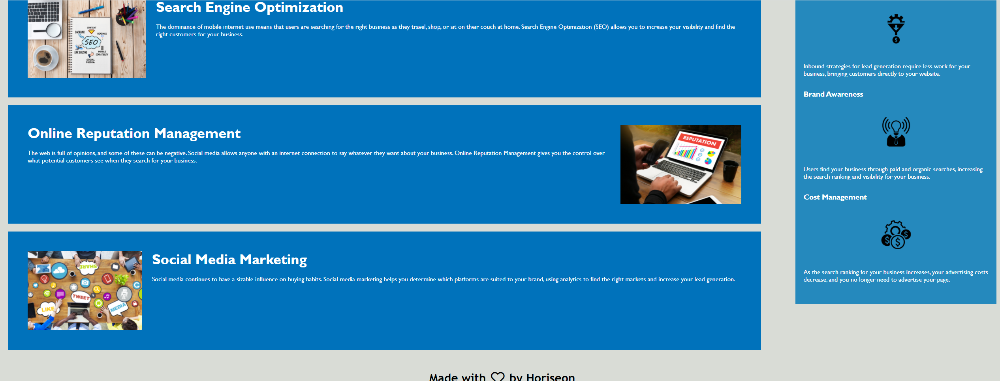

# REFACTORING CODE

## Purpose

The purpose of this project was to edit and improve existing code to make the given webpage more accessible and ensure it was functioning as expected.

## Approach

This was achieved by:

  Adding alt attributes to images and icons

  Changing divs to semantic HTML elements

  Reordering and consolidating CSS selectors and properties

  Debugging the code to fix a broken link

## Screenshot

## Link to project

https://hannahj25.github.io/firstassignment/